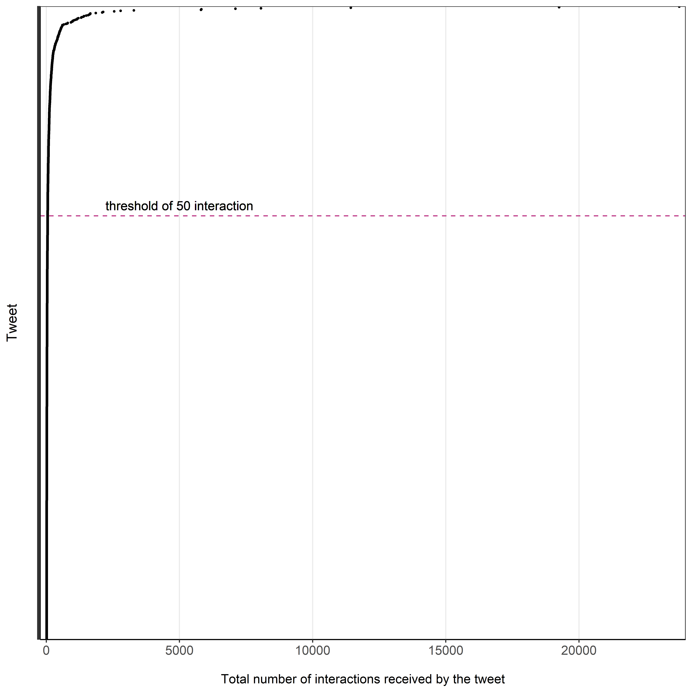
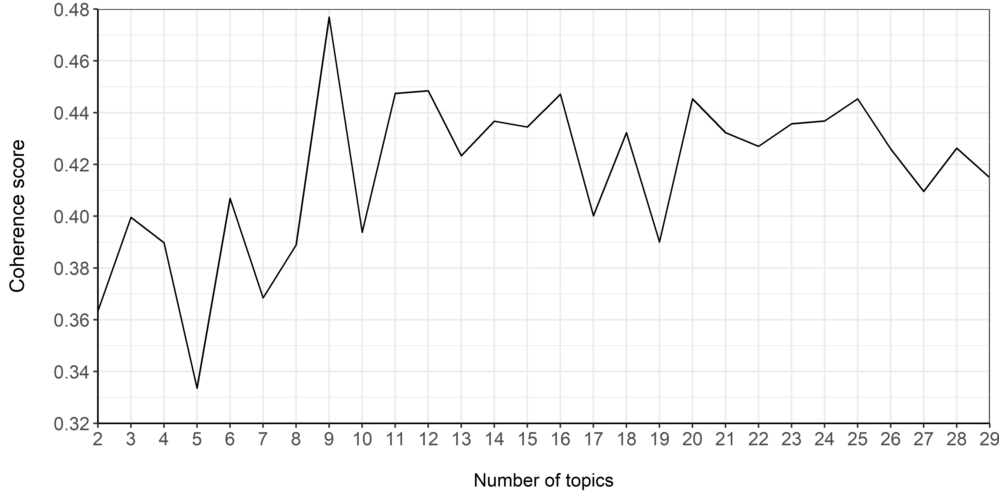
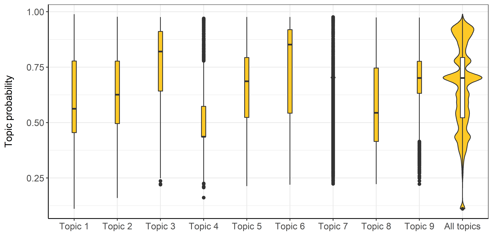
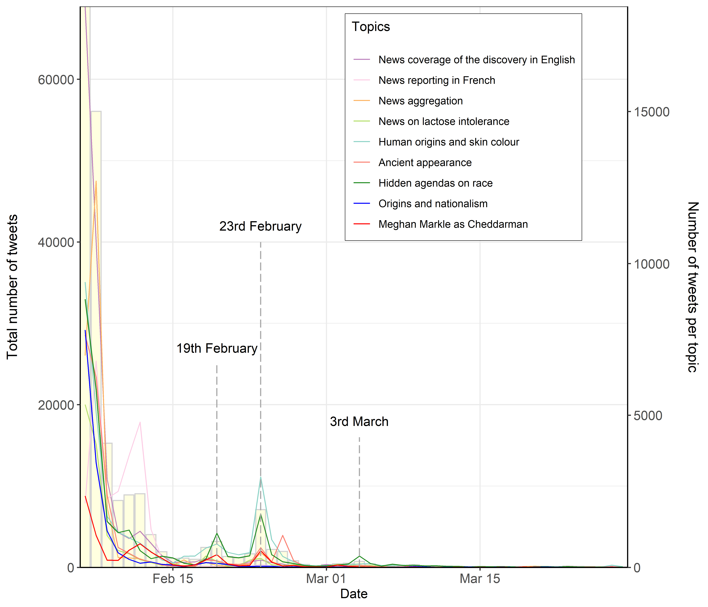
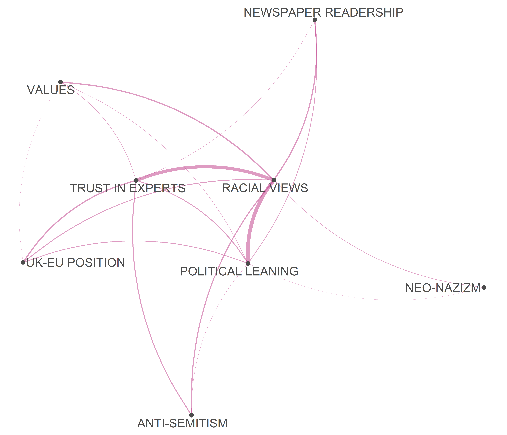

# HeritageTribalism_BigData
Software developed for the article: Bonacchi, C, Krzyzanska, M (2021) Heritage-based tribalism in Big Data Ecologies. Big Data &amp; Society  

This repository is a supplement to the paper *Human origins and antagonistic othering: a study of heritage-based tribalism on Twitter*. It contains the codes used for data collection and analysis, carried out using Mongo Database, R and Python. This file describes the workflow used in the paper, which consists of 7 sections:

1. [Data collection and processing](#data-collection-and-processing)
2. [Summary statistics](#summary-statistics)
3. [Links analysis](#links-analysis)
4. [Impact tweets extraction](#impact-tweets-extraction)
5. [Topic modelling](#topic-modelling)
6. [Boundary markers](#boundary-markers)

Each section briefly describes the analysis, linking to the code that was used to carry it out and produce the outputs. All the codes are located in the [codes](codes) folder, and are divided by the programming language in which they were written. In addition to that, folder [data_import_and_export](codes/data_import_and_export) contains the bash commands used to move data from/to the Mongo Database, R and Python. All the outputs produced are also displayed and linked in the relevant sections of this file and are located in the [outputs](outputs) directory. The numbers in front of the file names indicate the order in which the codes were execute and the outputs produced. Where possible, we included the files with the relevant data in the [data](data) directory. However, due to  user privacy concerns and Twitter's policy, which does not allow for the re-publication of modified tweets, most of them were not included in this directory. Please note that the figures which appear below are not numbered as they are in the main article, because more figures were included in this repository for explanatory purposes and to reproduce the exact workflow we followed.

## Data collection and processing

During the period between 12:05 on the 7th of February 2018 and 19:36 on the 28th of March 2018, we continuously captured tweets that included either 'cheddarman' or 'cheddar man', using the twitter streaming API, accessed via R, as documented in:

[Data collection](codes/R/01_01_Data_collection.R)

Since Twitter policy does not allow for re-publication of modified tweets (which includes anonymisation), the list of ids for all the collected tweets is provided [here](data/ids_cheddarman.csv).

The tweets were originally saved in json files and subsequently imported into the Mongo database running on the localhost:27017 with the [bash shell script](codes/data_import_and_export/data_import.sh). Once the data was imported, we deleted the empty documents introduced during the data import and deleted the duplicates inside the Mongo database:

[Data cleaning](codes/mongo/01_02_Data_cleaning.js)

Subsequently, the user identifiers (ids, names, and handles) and tweets ids were anonymised inside the database.

[Data anonymisation](codes/mongo/01_03_Data_anonymisation.js)

Finally, indices were created on the fields that needed to be frequently retrieved later on:

[Indexing](codes/mongo/01_04_Indexing.js)

For tweets that were quotes, retweets or replies, the metadata includes data about the original tweet they are referring to. We retrieved the basic information about the original tweets from the metadata, and integrated them with streamed tweets into a separate collection:

[Tweets from metadata extraction](codes/mongo/01_05_Tweets_from_metadata_extraction.js)

We also extracted the user data into a separate collection, for ease of access in further analysis:

[User data extraction](codes/mongo/01_06_User_data_extraction.js)

We exported the 2 collections with tweets and users as csv files (see [data export](codes/data_import_and_export/data_export)) for further analysis in R and Python. The files were not added to the public repository, as they include anonymised tweets and user data.

## Summary statistics

We pulled out basic information about the dataset, included in [Table 1](#table-1-basic-information-about-the-dataset) below, from the database, and exported it as csv files (see [data export](codes/data_import_and_export/data_export.sh)):

[Dataset information](codes/mongo/02_01_Collection_info_and_stats.js)

##### [*Table 1. Basic information about the dataset*](outputs/01_Dataset_information.csv)
|                                                    |             |
| :------------------------------------------------  |  ---------- |
|First streamed tweet timestamp                      |2018-02-07T12|
|Last streamed tweet timestamp                       |2018-03-28T19|
|Number of streamed tweets                           |201458       |
|Number of additional tweets extracted from metadata |2414         |
|Tweets created before 07.02.2018                    |82           |
|Total number of tweets                              |203872       |
|Total number of unique users                        |140875       |

## Links analysis

We extracted all the links included in the tweets, together with the frequency with which they featured, both for the whole dataset and by date:

[Links extraction](codes/mongo/03_01_Links_extraction.js)

We exported link frequencies as csv files with the bash command (see [data export](codes/data_import_and_export/data_export.sh)). As some of the links referred to tweets by named private users, we anonymised those manually for links that featured more than 20 times and saved them to a separate csv [file](data/anonymised_links.csv). This file differs from the original links.csv file only in that the links to tweets by private individuals were replaced by the term 'anonymised', and the file only includes the links that featured 20 times or more. We also prepared the anonymised version of [link frequecies by date](outputs/02_linksByDate.csv), which excludes links to private profile statuses, and links that featured less than 20 times in the dataset. Subsequently we have extracted the top 10 links for the first day of data collection, excluding the accounts of private individuals, and manually aggregated the links that pointed to the same websites, to make the [table](data/l0207.csv) included in the article as Tabel 2. We have also extracted all the links that were shared >10 times, on the 'peak' (see [Topic modelling](#topic-modelling)) dates (19.02.2018,23.02.2018,03.03.2018) and manually aggregated the links that pointed to the same website and removed the links to the profiles of the individuals. We have extracted these [links](data/peak_links.csv) to prepare the Table 4 in the article.

[Links frequencies](codes/R/03_02_Links_frequencies.r)

## Impact tweets extraction:

We aggregated the tweets by the frequencies with which they were retweeted, quoted or replied to, in order to obtain the most 'interacted with' tweets.

[Impact tweets extraction](codes/mongo/04_01_Impact_tweets_extraction.js)

We extracted this data and saved it in a csv format (see [data export](codes/data_import_and_export/data_export.sh)) for qualitative analysis and visualisation in R. The csv files are not included in the public repository, as they contain anonymised Twitter data that cannot be re-published.

We plotted the number of interactions for all the tweets that received more than 10 interactions, and decided to set the threshold of >50 interactions ([Figure 4](#figure-4-threshold-for-the-most-interacted-with-tweets)) to select a sample of tweets for qualitative analysis:

[Impact tweets plot](codes/R/04_01_Impact_tweets_plot.R)

##### Figure 4. Threshold for the most interacted with tweets

## Topic modelling

We carried out topic modelling on the texts of all unique tweets extracted from the database (see [Section 1](#data-collection-and-processing) and [extraction of tweets from metadata](codes/mongo/01_05_Tweets_from_metadata_extraction.js)), using the LDA method available in Python's [gensim](https://radimrehurek.com/gensim/) library. We constructed models for the number of topics n=2:29 and calculated the [coherence scores](outputs/04_coherenceScores.csv) for each (see also visualisation below). We selected the model with the highest coherence score (9 topics, see [Figure 5](#figure-5-lda-models-coherence-scores)), prepared the [intertopic distance](outputs/05_topic_model.html) visualisation for it and manually assigned the topic labels ([Table 2](#table-2-topic-labels)) based on the term probabilities returned by the model. Then we assigned a dominant topic to each tweet based on the probability distribution of terms in the tweets over topics. The analysis was carried out in Python and is provided in the file:

[Topic model](codes/python/05_01_Topic_model.py)

##### [*Table 2. Topic labels*](outputs/06_Topic_labels.csv)

|Topic number |Label                                          |
|-------------|-----------------------------------------------|
|1            |Human origins and skin colour                  |
|2            |Hidden agendas on race                         |
|3            |News coverage of the discovery in English      |
|4            |Ancient appearance                             |
|5            |News on lactose intolerance                    |
|6            |Origins and nationalism                        |
|7            |News aggregation                               |
|8            |Meghan Markle as Cheddarman                    |
|9            |News reporting in French                       |

The information about the dominant topic was then passed on into the database (see [data import](codes/data_import_and_export/data_import.sh)), and added to the tweets collections. Dominant topics were also assigned to each user based on which topic was most frequently identified as dominant in the tweets they authored:

[Topic assignment](codes/mongo/05_02_Topic_assignment.js)

Additionally, the coherences scores for different numbers of topics ([Figure 5](#figure-5-lda-models-coherence-scores)) were plotted in R, together with the distribution of probability scores of dominant topics for each tweet ([Figure 6](#figure-6-distribution-of-probability-scores-of-dominant-topics)):

[Topic model diagnostics](codes/R/05_03_Topic_model_diagnostics.R)

##### Figure 5. LDA models coherence scores

##### Figure 6. Distribution of probability scores of dominant topics

Subsequently, we calculated and plotted the daily frequencies of all tweets and the tweets assigned to the specific topics [Figure 7](#figure-7-topics-over-time)), which revealed 3 peaks with higher frequency of tweets after the initial drop-off whih occurred two days after the publication of the news. The details of this analysis are provided in:

[Topics over time](codes/R/05_04_Topics_over_time.R)

##### Figure 7. Topics over time

We extracted the tweets that were most frequently retweeted or quoted on the dates when the peaks appeared, and exported them as csv files for qualitative analysis (see [data export](codes/data_import_and_export/data_export.sh)); the csv files are not included in the public repository, as they contain anonymised tweets:

[Peaks extraction](codes/mongo/05_05_Peaks_extraction.js)

## Boundary markers

The qualitative analysis of the most interacted with tweets for selected topics allowed us to identify terms used to define tribes. From those terms we inferred 'boundary markers'. We then identifed tribes and relevant boundary markers in the whole dataset and exported them for analysis in R (see [data export](codes/data_import_and_export/data_export.sh)):

[Boundary markers](codes/mongo/06_01_Boundary_markers.js)

Subsequently, we extracted data about the boundary markers into the csv files, and analysed the co-occurrence of their categories within the [tweets posted by the same user](outputs/10_userTribes.csv) ([Figure 9](#figure-9-co-occurrence-of-different-boundary-marker-categories-within-tweets-by-the-same-author)) using the feature co-occurrence matrix.

[Boundary markers co-occurrence](codes/R/06_01_Boundary_markers_coocurrence.R)

##### Figure 9. Co-occurrence of different boundary marker categories within tweets by the same author

